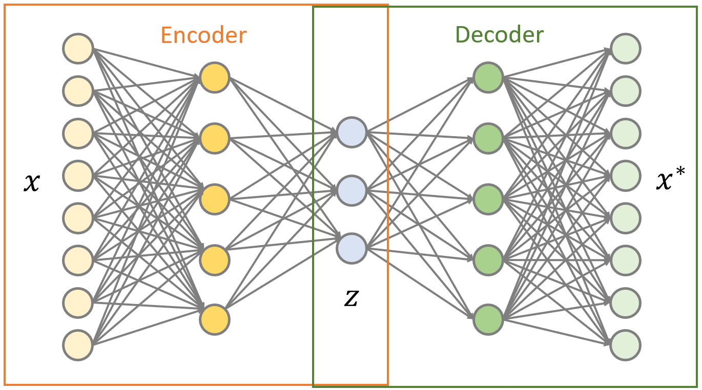

# Audit Sampling With Autoencoders
Seeing financial transactions in lower-dimensions with neural networks

# Acknowledgements
This project is largely inspired by a paper published in 2020 by Marco Schreyer, Timur Sattarov, Anita Gierbl, Bernd Reimer, and Damian Borth, entitled [Learning Sampling in Financial Statement Audits using Vector Quantised Autoencoder Neural Networks](https://arxiv.org/pdf/2008.02528.pdf), as well as an excellent demonstration of autoencoders by Alexander Van de Kleut, entitled [Variational Autoencoders (VAE) with PyTorch](https://avandekleut.github.io/vae/).

## Table of Contents
1. [How To Use This Repository](#howto)
2. [Supporting Packages](#packages)
3. [Project Motivation](#motivation)
4. [About The Dataset](#data)
5. [File Descriptions](#files)
6. [Results](#results)

## How To Use This Repository 
1. Download and unzip this repository to your local machine.
2. Navigate to this directory and open the command line. For the purposes of running the scripts, this will be the root directory.
3. Create a virtual environment to store the supporting packages

        python -m venv ./venv

4. Activate the virtual environment

        .\venv\Scripts\activate

5. Install the supporting packages from the requirements.txt file

        pip install -r requirements.txt
        
6. To run the ETL pipeline that cleans data and pickles it, type the following in the command line:
        
        python data/preprocessing.py data/city_payments_fy2017.csv

7. To train a traditional autoencoder and save the model locally, type the following in the command line:

        python scripts/models.py data/philly_payments_clean ae 5
       
Note: This is provided as an example, you can also chooose "vae" and a number of epochs other than 5. 
When training is complete an html file is generated providing a visualization of the embedded transaction data.

## Supporting Packages 
In addition to the standard python libraries, this notebook and analysis rely on the following packages:
- PyTorch https://pytorch.org/
- plotly https://plotly.com/
- sklearn https://scikit-learn.org/stable/

Please see `requirements.txt` for a complete list of packages and dependencies utilized in the making of this project

## Project Motivation 
Auditing standards require the assessment of the underlying transactions that comprise the financial statements to detect errors or fraud that would result in material misstatement. The accounting profession has developed a framework for addressing this requirement, known as the Audit Risk Model.

The Audit Risk Model defines audit risk as the combination of inherent risk, control risk and detection risk:

Detection risk is composed of sampling risk and non-sampling risk:

We focus our attention on sampling risk, which is defined as the risk that the auditor's conclusion based on the sample would be different had the entire population been tested. In other words, it is the risk that the sample is not representative of the population and does not provide sufficient appropriate audit evidence to detect material misstatements.

There are a variety of sampling methods used by auditors. Random sampling is based on each member of the population having an equal chance of being selected. Stratified sampling subdivides the population into homogenous groups from which to make selections. Monetary unit sampling treats each dollar amount from the population as the sampling unit and selects items when a cumulative total meets or exceeds a predefined sampling interval when cycling through the population.

**Autoencoders** offer an alternative method for addressing sampling risk. An autoencoder is a neural network that learns to encode data into lower dimensions and decode it back into higher dimensions. The resulting model provides a low-dimensional representation of the data, disentangling it in a way that reveals something about the fundamental structure. Auditors can model transactions in this way and select from low-dimensional clusters. They can also identify anomalous transactions based on how much they deviate from other transactions in this latent space.

## About The Dataset 
To demonstrate the use of autoencoders for financial transaction analysis, we will use the [City of Philadelphia payments data](https://www.phila.gov/2019-03-29-philadelphias-initial-release-of-city-payments-data/). It is one of two datasets used in Schreyer et al (2020) and consists of nearly a quarter-million payments from about 60 city offices, departments, boards and commissions. It covers the City's fiscal year 2017 (July 2016  through June 2017) and represents nearly $4.2 billion in payments during that period.

## File Descriptions 
| File | Description |
| :--- | :--- |
| data/city_payments_fy2017.csv | features: dept, trans amount, date, purchased item, etc.|
| data/ASWA.ipynb | jupter notebook used to develop analysis |
| models/preprocessing.py | module for ETL, prepares data for neural network |
| models/models.py | module with autoencoder classes and methods for analysis |

## Results 

More about this project can be found at the Medium blog post.
